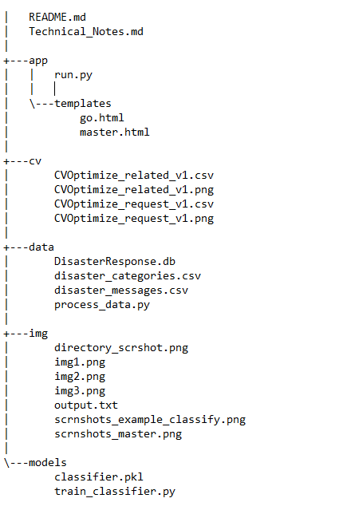
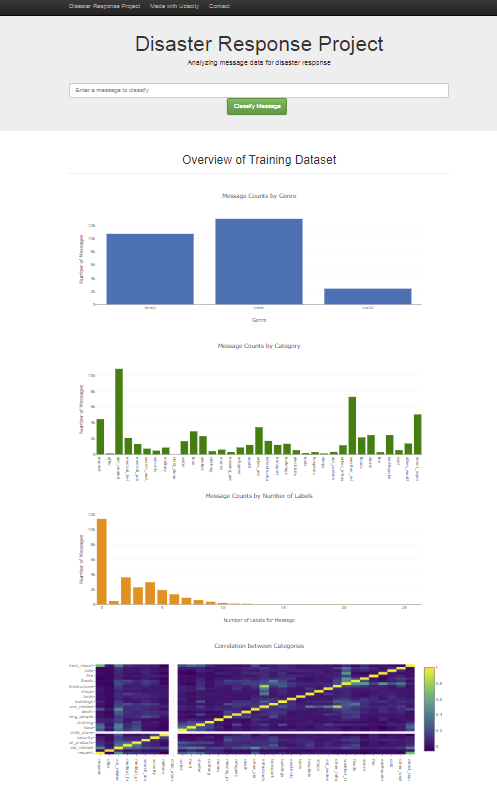
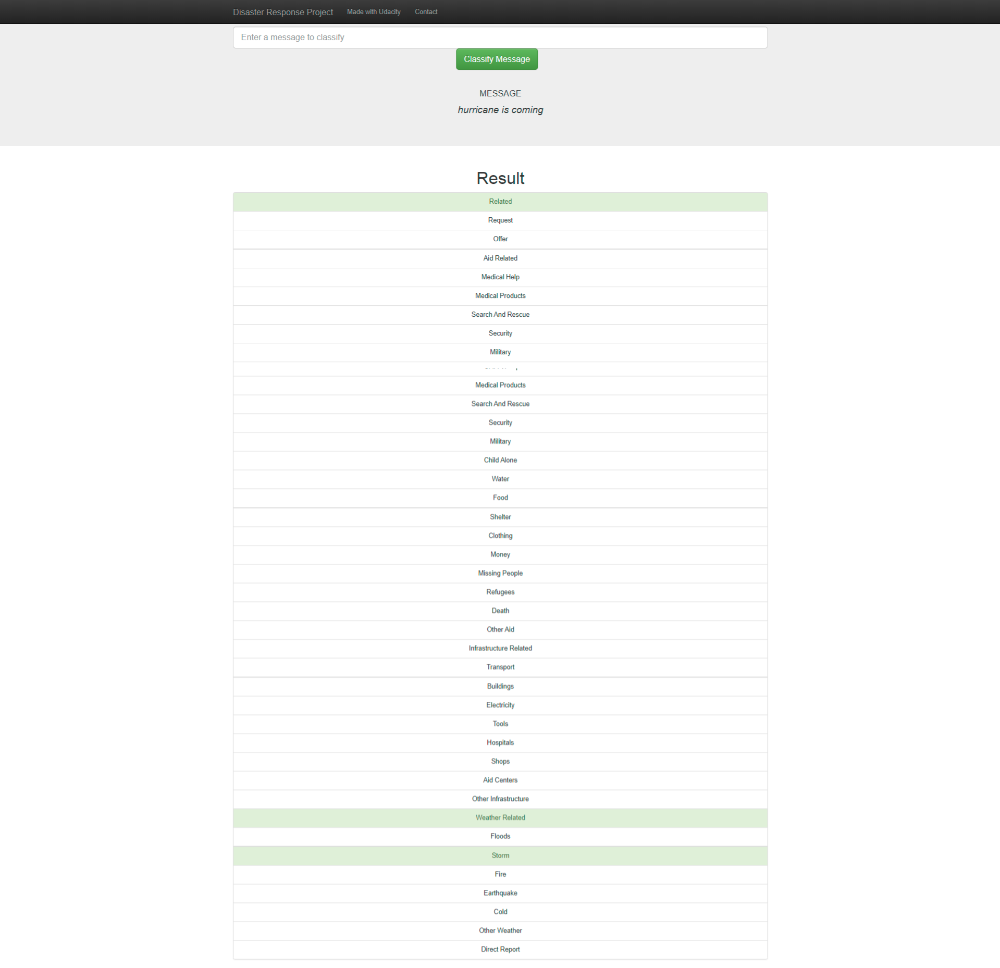

# Disaster Response Pipeline Project


### Summary of Project

The project classifies a message to one of 36 categories for better disaster response. The classification model is trained using supervised learning with labeled messages. The trained model then interacts with a webapp so that users can classify a new message to one of the categories. This file is to provide overview of project, please refer to my [technical notes](Technical_Notes.md) for detailed technical analysis.

### Run Instructions:

1. Packages required:
  - Numpy
  - Pandas
  - Scikit-Learn
  - sqlalchemy
  - NLTK
  - Re
  - [Imbalanced-Learn](https://imbalanced-learn.readthedocs.io/en/stable/index.html)
  - Other Support packages include time, statistics, math and matplotlib  


2. Run the following commands in the project's root directory to set up your database and model.

    - To run ETL pipeline that cleans data and stores in database
        ```
        python data/process_data.py data/disaster_messages.csv data/disaster_categories.csv data/DisasterResponse.db
        ```

    - To run ML pipeline that trains classifier and saves
    ```
        python models/train_classifier.py data/DisasterResponse.db models/classifier.pkl
    ```

Note: I tried to upload trained classifier classifier.pkl to GitHub, but due to the large size (>100MB), it was not possible. Please use above instructions to train classifier.

2. Run the following command in the app's directory to run your web app.
    `python run.py`

3. Go to http://0.0.0.0:3001/ if the app is deployed. If webapp hosted on local host, go to http://localhost:5000/.

#### Files in the Repository:


The files are put into several folders.
- The 'app' folder contains the webapp
- the 'cv' folder contains results for cross-validated parameter optimization for each label (the snapshot just shows 2 labels as an example)
- the 'data' folder contains original datasets in csv format, the python script to process data, and the cleaned dataset
- the 'img' folder contains images for use in various markdown files
- the 'model' folder contains trained model and python script to train classifier (though the trained model is too large to upload to GitHub, so excluded from the online repo)

### Webapp Visualizations
After the webapp is disployed, the main page shows an interactive box for the user to input new messages for classification. Below the box are 4 images to show how the dataset looks like as shown below. After a message is input, the user is taken to a next page that shows classify results. As shown below, after message 'hurricane is coming' is input, several categories are highlighted in light green, including 'related', 'storm' and more.  





### About the Dataset

The dataset is provided as part of the Udacity Data Science NanoDegree by company XX, which specializes in disaster response. The dataset categorizes/labels messages from Twitter in 36 categories. Specifically, there are two files provided. One file contains messages in English and in its original language, and each message has a distinct message ID. The second file contains category information associated with the message IDs. The files have the same number of messages.
