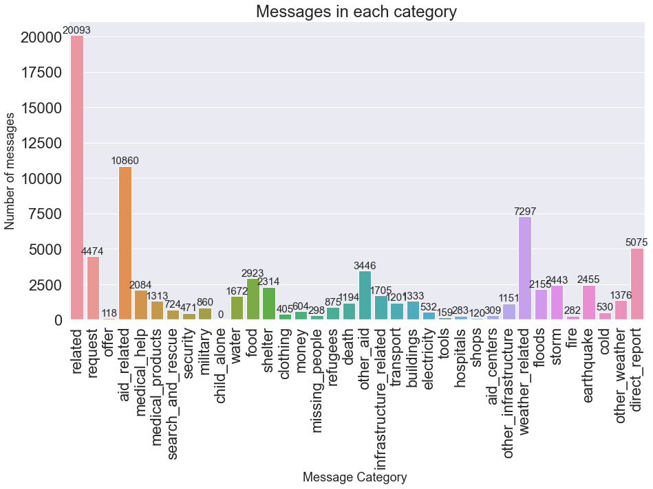
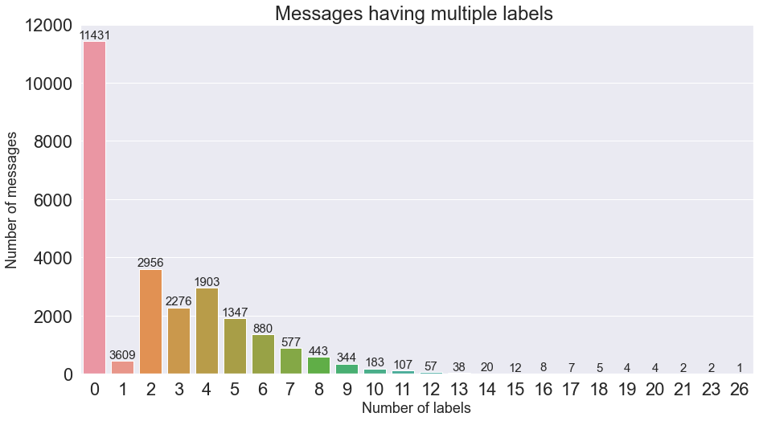
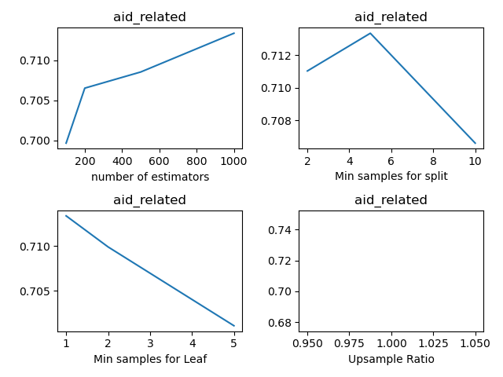

### Data Cleaning

The dataset loads two csv files from the provided filepaths, and merges them on message ID. Then the data is cleaned in the following steps:
1. Split categories information (string) into separate category columns. Rename columns of categories with new column names
2. Convert category values to just numbers 0 or 1. Note that the first category 'related' also contain category value as number 2. Remaining categories are binary.
3. Replace categories column in df with new category columns.
Note the label 'related' has only 204 messages labeled with 2, it is likely an outlier. I've decided to replace label '2' with '1' for label 'related'
4. Remove duplicates
5. Remove columns with only 1 label. This applies to the label 'child_alone', since there is no positive label for 'child_alone' at all in the dataset.
6. Save the dataframe in database provided in the database filepath.

Now we're ready to perform some exploratory data analysis on cleaned data. Primarily we are interested in (a) Data Categories (2) Data Imbalance (3) Data Correlations. These characteristics of the dataset are important for building and evaluating machine learning models in the next step.

#### Exploratory Data Analysis: Categories
First, we can count how many messages are labeled within the 35 categories. The total number of messages after cleaning is 26216. Based on the following figure, one can see that the categories with more than 2000 messages are: aid_related, weather_related, direct_report, request, other_aid, food, earthquake, storm, shelter, floods and medical_help.




<br></br>
While categories such as aid_related and weather_related are general, they encompass other categories such as food, shelter and medical_help (aka aid_related) as well as earthquake, storm, and floods (aka weather_related). These categories suggest that the response team in client company can prioritize connection with organizations that support people suffering from natural disasters, such as FEMA, as well as organizations that support people for their everyday lifelihood such as the food bank organization Feeding America.

Links:
- www.fema.gov (FEMA)
- www.feedingamerica.org (Feeding America)

#### Exploratory Data Analysis: Imbalanced Data

Most category labels are very imbalanced and there are a lot more 0's than 1's. From the above plot, many categories only have fewer than a few hundred messages.

The dataset is also very sparse. The number of non-zero entries in all category values (35 categories and 26216 samples) is only 8.8%, despite the fact that the number of samples/messages with more than 1 non-zero entry is more than 75%.  This suggests a message is only labeled as 1 very rarely. The following figure shows just that. More than 40% of messages have no labels at all. Most messages are labeled with fewer than 5 labels out of 35 possible labels.





<br></br>
The abovementioned imbalances make it difficult to train or evaluate a machine learning algorithm. It is hard to train the model because there are so few positive labels and many models may not be able to capture the variance between the 1 and 0. To address the training difficulty, we upsample our training dataset to include more 1 values. We discuss more details in the following sections.


### Build, Optimize and Train Model


As evident from the EDA sections, our problem is a multi-label problem, where each message can have more than 1 labels under these categories.


#### Choice of Model Architecture
There are several methods to construct models for the multi-label problem, such as one-vs-rest, binary-relevance and classification chains. Becuase of the stronlgy imbalanced dataset, multi-output classifiers with only one set of hyperparameter may not work so well, so we train one pipeline for each of the 35 labels.

Therefore, for each of the label, I build a pipeline as follows:
  ```
make_pipeline_imb(CountVectorizer(tokenizer=tokenize),
                TfidfTransformer(),
                SMOTE(k_neighbors=1, random_state=seed,sampling_strategy=sample_ratio),
                RandomForestClassifier(n_jobs = 8, n_estimators = n_estimators,
                min_samples_split = min_samples_split, min_samples_leaf = min_samples_leaf))
```
The text first is fed into two subsequent feature extractors (CountVectorizer, TfidfTransformer), the dataset is upsampled using SMOTE method, then trained with random forest (RF) classifier. There are 4 hyperparmameter to optimize:
- Sample Ratio (sample_ratio) between minority and majority class for SMOTE method
- Number of estimators (n_estimators) for RF classifier
- Min samples split  (min_samples_split) for RF classifier
- Min samples leaf (min_samples_leaf) for RF classifier

#### Model Hyperparameter Tuning

A crucial step of hyperparmameter tuning is make sure the evaluation is done correctly. Because we have upsampled our dataset in our pipeline, it does not make sense to evaluate on the upsampled dataset. The metrics have to be evaluated on a different test set split from the ORIGINAL dataset. In addition, GridsearchCV could not be easily applied on the imbalanced-learn pipeline, so I wrote my own gridsearch code in ``` build_optimize_model(X_train, y_train, X_test, y_test)```.

The metric we optimize for each label's pipeline is F1-score for the positive label. It does not make sense to evaluate F1 for both labels, because (1) the dataset is strongly imbalanced and the negative label's F1 value strongly distorts the overall F1 score and (2) there is much more utility in accurately predicting a positive label so that client company can quickly detect the message's related category.

We also optimize for a classification threshold for each of the pipelines. For each pipeline, we predict probability of label being positive using ```predict_proba(X_test)[:,1]```, then we set a threshold where we classify as positive for probability above such threshold. This is so that we could better customize our pipeline to increase F1-score.

The optimization step is performed on 30% sub-set of the data; the cross-validated metrics are saved in folder 'cv' where each label has a CSV file such as 'CVOptimize_aid_related_v1.csv' and a figure recording how the F1-score for positive label changes with hyper-parameters, while other hyper-parameters are fixed at optimal. An example image is shown here:




#### Model Training

After the hyperparameters are optimized for each of the 35 labels, we train each label's pipeline using the entire dataset (80% for model training, 20% for model evaluation). The script to do that is in function  ```train_model(X_train, y_train, model)```.


### Model Evaluation

Once the model is trained, the model performance is evaluated. We break down the performance into several parts as follows:
1. Label-based classification performance
2. Averaging of label-based multi-label performance
    - Macro average
    - Micro average


#### Test Data
I clarify that the test data is split from the original dataset, without any upsampling.

#### Label-Based Evaluation for Multi-Label Classifier
We use the label-based evaluation method for multi-label classifier. For each label, we output confusion matrix for both labels.

For the positive label that we're interested in, we obtain the number of true positives (TP), true negatives (TN), false negatives (FN) and false positive (FP). We also output resulting precision, recall and f-score for the positive label. Note that since our label has more '0', or negatives, precision and recall for the positive label are good metrics. They can correctly identify a bad classifier that naively treats all labels as 0s.

#### Averaging Multi-Class and Multi-Label
We evaluate the overall performance by averaging with two methods, macro and micro average. The macro-average method takes the average of a specific metric for all 35 labels. The micro-average finds, globally, the total number of TP, TN, FP, FN and calculate the metric from these global totals. Other Interesting metrics we could explore in the future are AUC-precision-recall and AUC-ROC.

#### Final Model Performance
