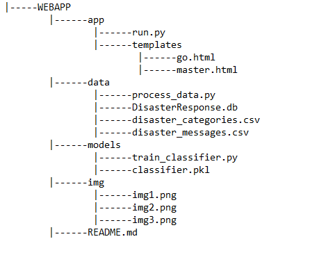
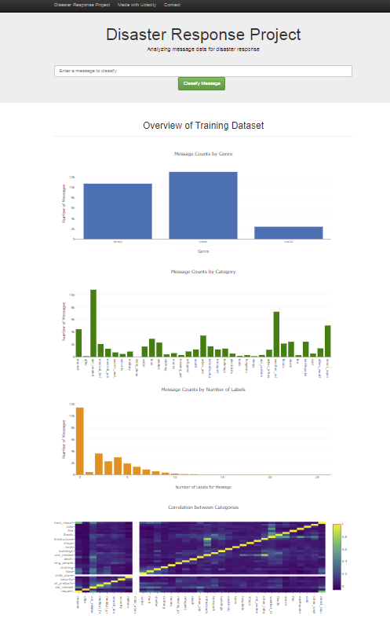
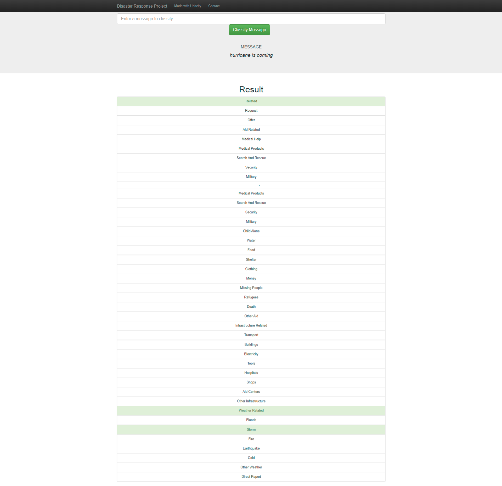
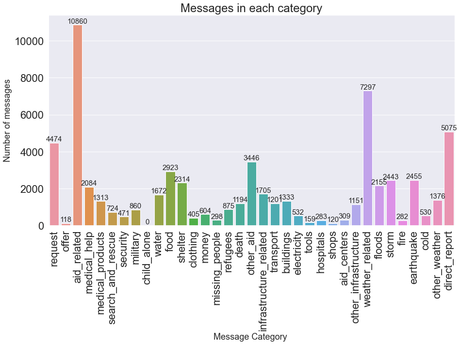
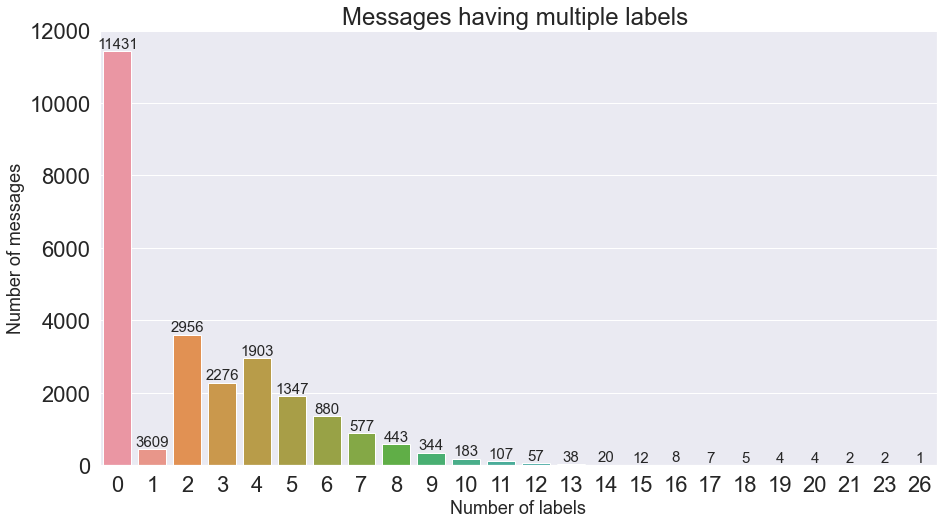
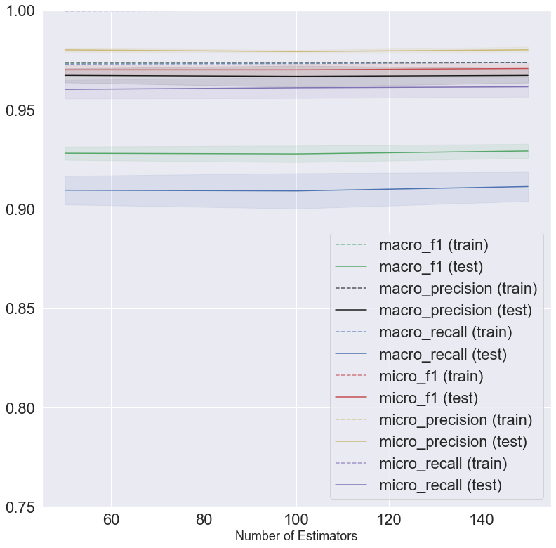

# Disaster Response Pipeline Project

### Summary of Project

The project classifies a message to one of 36 categories for better disaster response. The classification model is trained using supervised learning with labeled messages. The trained model then interacts with a webapp so that users can classify a new message to one of the categories. 

### Run Instructions:
1. Run the following commands in the project's root directory to set up your database and model.

    - To run ETL pipeline that cleans data and stores in database
        `python data/process_data.py data/disaster_messages.csv data/disaster_categories.csv data/DisasterResponse.db`
    - To run ML pipeline that trains classifier and saves
        `python models/train_classifier.py data/DisasterResponse.db models/classifier.pkl`

2. Run the following command in the app's directory to run your web app.
    `python run.py`

3. Go to http://0.0.0.0:3001/ if the app is deployed. If webapp hosted on local host, go to http://localhost:5000/. 

#### Files in the Repository:

### Webapp Visualizations
After the webapp is disployed, the main page shows an interactive box for the user to input new messages for classification. Below the box are 4 images to show how the dataset looks like as shown below. After a message is input, the user is taken to a next page that shows classify results. As shown below, after message 'hurricane is coming' is input, several categories are highlighted in light green, including 'related', 'storm' and more.  

### About the Dataset

The dataset is provided as part of the Udacity Data Science NanoDegree by company XX, which specializes in disaster response. The dataset categorizes/labels messages from Twitter in 36 categories. Specifically, there are two files provided. One file contains messages in English and in its original language, and each message has a distinct message ID. The second file contains category information associated with the message IDs. The files have the same number of messages.

### Data Cleaning

The dataset loads two csv files from the provided filepaths, and merges them on message ID. Then the data is cleaned in the following steps:
1. Split categories information (string) into separate category columns. Rename columns of categories with new column names
2. Convert category values to just numbers 0 or 1. Note that the first category 'related' also contain category value as number 2. Remaining categories are binary. 
3. Replace categories column in df with new category columns.
4. Remove duplicates
5. Save the dataframe in database provided in the database filepath. 

Now we're ready to perform some exploratory data analysis on cleaned data. Primarily we are interested in (a) Data Categories (2) Data Imbalance (3) Data Correlations. These characteristics of the dataset are important for building and evaluating machine learning models in the next step. 

#### Exploratory Data Analysis: Categories
First, we can count how many messages are labeled within the 35 categories except for 'related' category. The total number of messages after cleaning is 26216. Based on the following figure, one can see that the categories with more than 2000 messages are: aid_related, weather_related, direct_report, request, other_aid, food, earthquake, storm, shelter, floods and medical_help. 

While the first few categories such as aid_related and weather_related are general, they do encompass other top categories such as food, shelter and medical_help (aka aid_related) as well as earthquake, storm, and floods (aka weather_related). These categories suggest that the response team in company XX can prioritize connection with organizations that support people suffering from natural disasters, such as FEMA, as well as organizations that support people for their everyday lifelihood such as the food bank organization Feeding America.

Links:
- www.fema.gov (FEMA)
- www.feedingamerica.org (Feeding America)

#### Exploratory Data Analysis: Imbalanced Data

Most category labels are very imbalanced and there are a lot more 0's than 1's. From the above plot, many categories only have fewer than a few hundred messages. The 'related' column also has strong imbalance, with only 188 messages labeled with value 2, 6122 messages labeled with value 0 and 19906 messages labeled with value 1. 

The dataset is also very sparse. The number of non-zero entries in all category values (36 categories and 26216 samples) is only 8.8%, despite the fact that the number of samples/messages with more than 1 non-zero entry is more than 75%.  This suggests a message is only labeled as 1 very rarely. The following figure shows just that. More than 40% of messages have no labels at all. Most messages are labeled with fewer than 5 labels. 

The abovementioned imbalances make it difficult to train or evaluate a machine learning algorithm. It is hard to train the model because there are so few positive labels and many models may not be able to capture the variance between the 1 and 0. To address the training difficulty, we upsample our training dataset to include more 1 values. We discuss more details in the following sections. 

### Modeling

As evident from the EDA sections, our problem is a mixed multi-class, multi-label problem. The column 'related' is a multi-class problem that classifies message into 1 of the 3 categories (0,1 and 2). The remaining 35 columns constitute a multi-label problem where each message can have more than 1 labels under these categories. 

Note: while it makes sense to remove the 'child-alone' column as there are only 0's in the dataset, the rubric specifically asks for all 36 categories so the column is left here.

#### Choice of Model Architecture
There are several methods to construct models for the multi-label problem, such as one-vs-rest, binary-relevance and classification chains. However, because our problem also combines with a multi-class problem, we have to find models that can work with both multi-class and multi-label/multi-output. 

Therefore, I use the MultiOutputClassifer() from scikitlearn to build our model, with a base model including tree-based and neighbor-basd methods, such as Decision Trees, K-Nearest-Neighbors and Random Forest. In light of more time, one can try to combine a multi-class classifier with a multi-label classifiers and explore the various model architectures mentioned above.

#### Upsampling to Train Imbalanced Data

I first subset samples/rows with non-zero entries, and then upsample this subset with replacement, so that the number of samples/rows with non-zero entries increases to 5 times the orginal number. Then we train our classifier pipeline on the upsampled data. Such a method dramatically increased sub-set accuracy of our multi-label problem (the 35 categories except 'related' column) from around 40% to more than 90%. Subset accuracy, as described below, finds the fraction of exact matched sample/rows of predicted result with test result. It is also one of the most stringent metric to evaluate multi-label problems. 

### Model Evaluation 

Once the model is trained, the model performance is evaluated. We break down the performance into several parts as follows:
1. Multi-label classification performance 
    - Label-based
    - Sample-based
2. Multi-class classification performance
3. Averaging of label-based multi-label performance and multi-class performance 
    - Macro average
    - Micro average

#### Down-Sampling Test Data
I clarify that the test data is also down-sampled before evaluation of the model. The sample/rows with non-zero entries are first subset, and then down-sampled so that the rows containing non-zero entries account for about 75% of all samples. This is close to the original statistics of the dataset, where about 76% of all samples contain non-zero entries. 

#### Label-Based Evaluation for Multi-Label Classifier
We use the label-based evaluation method for multi-label classifier. For each label, we calcualte both the binary confusion matrix for the label =1, as well as the confusion matrix. For the label=1, we obtain the number of true positives, true negatives, false negatives and false positive, and the resulting precision, recall and f-score for the '1' label. Note that since our label has more '0', or negatives, precision and recall are good metrics. They can correctly identify a bad classifier that naively treats all labels as 0s and are not skewed up artifically. 

#### Sample-Based Evaluation for Multi-Label Classifier
We can also use sample-based evaluation metrics to evaluate our multi-label classifier. Though this evaluation method is not included in the 'train_classifier.py' file, but can be found in the accompanying notebook. For the sake of simplicity, I include only results here. The sub-set accuracy is greater than than 92% and hamming loss is less than 0.5%.  

#### Evaluation for Multi-Class Classifier (Column 'related')
I treat the multi-class classifier as 3 separate labels. The confusion matrix, as well as precision, recall and fscore are calcualted for each of the label. I note that for the label=0, our trained classifier is not performing very well with a f-score around 0.2 and recall below 0.2. This indicates that for the multi-class problem, our trained classifier tends to predict 1 for when label =0. This is likely due to our upsampled 1 entries. The multi-class label actually has a flipped balance from the other 35 categories, so upsampling of non-zero entries actually hurt the performance of the multi-class classifier. However, given that this is only 1 label and does not seem of more importance than other labels, we can sacrifice a little performance here. If time allows, one can try flip the label of 0 and 1 in this multi-class problem and may see better performance.

#### Averaging Multi-Class and Multi-Label 
We evaluate the overall performance by combining multi-class and multi-label performance. Two averaging methods are used. The macro-average method takes the average of a specific metric for all 35+3(multi-class) labels and take the average. The micro-average finds, globally, the number of TP, TN, FP, FN and calculate the metric from these global sums. 

### Grid Search

We performed a gridsearch on a subset of our samples for faster optimization. We found that as number of estimators increase in the random forest classifier, all the metrics stay relatively same, with small changes. In the final classification model, we used 100 estimators. More gridsearch optimziation can be done if more improvements on the model is needed. As of now, the classification performance is quite good. 

